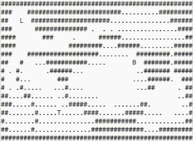
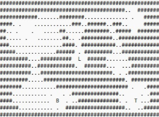
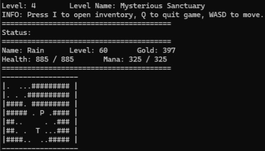
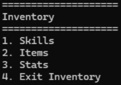
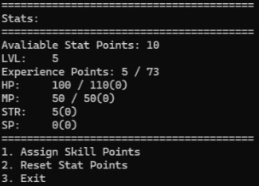
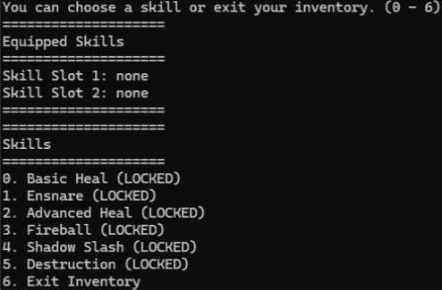
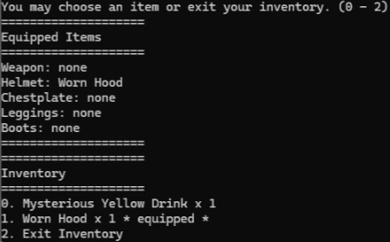
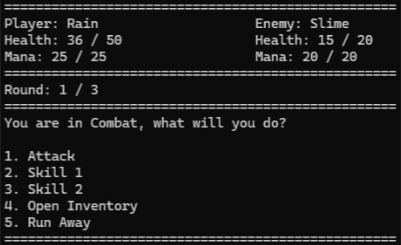
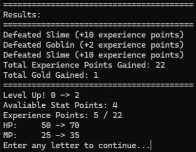
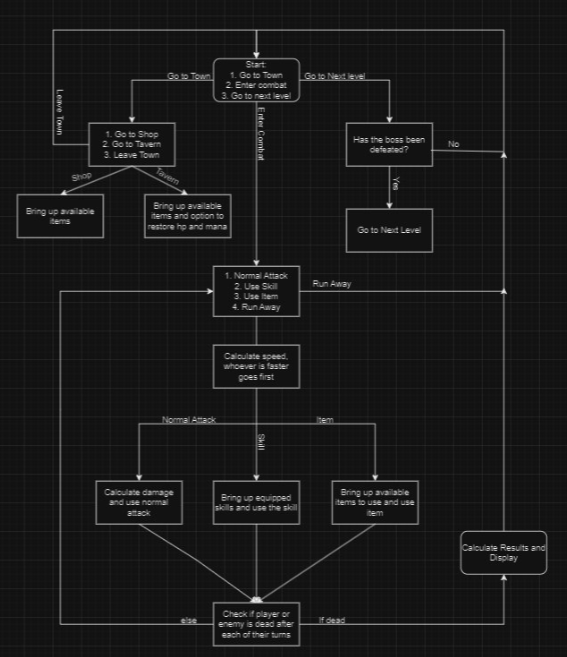

# TextBasedRPG
In Console Text based RPG using Visual Studio and C++. The "CombatSystem" folder is the file that contains all the txt files for the maps, and the code for the game. Overall, this was my first programming project that I wrote in 2023 that I am now uploading to GitHub. It uses basic logic components like if statements, for loops, while loops, arrays, vectors, etc. Hence all the nested logic and inefficient code that is in this project. Though I think its still a cool project for me at the time that helped me really understand objects and classes. Below I explain the main game loop and a lot of things that can be customized in code. Though I will not go to in depth into everything just a general idea.

## Concept Overview:
ASCII style map that player can move around in containing the following tiles.

| Symbol  | Explanation |
| ------------- | ------------- |
| P | Player (gives a visual representation of the player position) |
| T | Town (when player walks into tile will show "Town" scenario) |
| L | Level (when player walks into tile, check if player has beat boss then gives option to go to next level) |
| B | Boss (when player walks into tile triggers boss fight for that level) |

| Map Tiles  | Explanation |
| ------------- | ------------- |
| '#' | wall (player cannot move into or past this tile) |
| '.' | grass (when player walks into tile they have a random chance of triggering an enemy encounter) |
| ' ' | space (just empty space that player can walk through and does/triggers nothing) |

Maps are individual to each level and are loaded at the start of the game from text files. Meaning these text files can be edited/customized to make different maps utilizing the above mentioned "Tiles". Size of maps can be made bigger or smaller using the text file as well. Below is some images of the text files that are currently in the game.
 

In Game the player can move around and interact with these different tiles on the map utilizing a smaller window size that centers on the player as they move. This is also why the map size can be made bigger or smaller. 
Image of how the game looks in this state.

From this state the player can trigger what can be grouped into three scenarios, Town, Inventory, and Combat. In the Town scenario the player is given options to open three different shops which each have their own inventory of items selling for different amounts of gold and each item has their own different stats. All of the item stats, names and each stores inventory and selling amounts can be customized in the code by modifying the specific object's initialization utilizing classes.

In the Inventory scenario player is given options to assign stat points that are given when leveling up, look at items in their inventory and equip items that are weapons or armor and consume items that are consumable. Players can also access their skills and equip them if unlocked.
Image of inventory options.

Image of stats page.

Image of skills page.

Image of item interaction page.

In the combat scenario there is two ways you can trigger combat. Normal combat is triggered from random chance when walking in grass on map. It will randomly pull 1 to 3 enemies from the pool of enemies that are in that level that are within the player's level. It will give you options to use default attacks, use either of the skills you equip or run away from combat. This is turn based so once the player takes a turn the enemy will take a turn. If there is multiple enemies the player will face them one by one in rounds. Once defeating all enemies there is a results page that will give experience points and gold depending on the enemies faced and show you if you level up and what stats increased, etc. Similarly, entering combat with a boss is triggered by stepping on the 'B' tile on the map. The main difference is that the boss can use skills and when defeating the boss you will unlock the skill for that level and gives you the ability to go onto the next level.

Image of in combat.

Image of results after combat.

## Simplified Flowchart of Main Game Loop:

